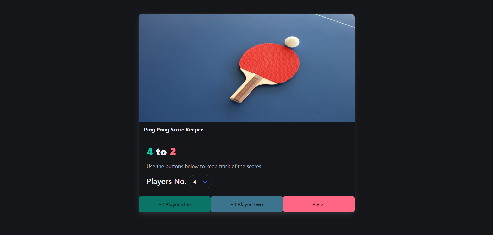

# PointPlay

A simple and responsive web app to keep track of ping pong scores between two players. Built using HTML, CSS (Bulma), and JavaScript to provide a clean and interactive scorekeeping experience.

---

## Features

- Track scores for two players
- Update scores with the click of a button
- Change the winning score dynamically
- Reset scores for a new game

---

## Technologies Used

- **HTML:** Structure of the web page
- **CSS (Bulma):** Styling and layout
- **JavaScript:** Logic for scorekeeping and game control

---

## 🚀 How to Run the Project

1. **Clone the repository:**
    ```bash
    git clone https://github.com/Misba0019/PointPlay.git
    ```
2. **Open `score_keeper.html` in your preferred web browser.**

---

## 🕹️ How to Use

- Click the player buttons to increase their scores
- Use the dropdown to set a winning score
- Press reset to start a new match

---

## Screenshot



---

## Credits

Images: [Unsplash](https://unsplash.com)

---

## License

This project is licensed under the MIT License - see the [LICENSE](LICENSE) file for details
